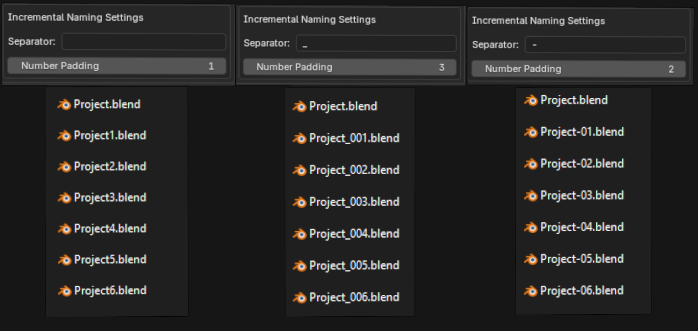

# Documentation - Save Incremental Copy Addon

This is a really simple addon for people who like to stay in the main file and just store an incremental copy.

## What it does:

This addon will add a button in the File Menu to save an Incremental Copy, without leaving the current file. You can change the Incremental naming in the settings.

Like on any other button you can assign a hotkey by right clicking on the button.

(Unfortunately i couldn´t figure out how to move the button under “save Copy” so if anyone knows how to do that i would really appreciate a short message.)

## Preferences / Changing the Naming Convention

By default the naming convention is Blenders Deafult. You can change it in the Addon-Preferences.

Please note that changing the naming convention will lead to ignoring all files saved with another naming convention (which can be useful sometimes). Changing the naming means also that blenders built in “save incremental” button creates incrementals which don´t match the custom naming convention. 

It is best to use just one of those buttons for each project/folder.

If you want to use both buttons in the same project without messing up the order of the incrementals, it is best to keep the default settings. (Seperator: empty, Number Padding: 1)

Here are some examples on how the Settings change the file name

It´s currently compatible with blender 4.2 and higher, if you want to test it in a previous version please write me or just change the blender_version_min in the manifest to whatever you like.

If you have any issues or feedback feel free to contact me via github or email: info@lurianworks.com
